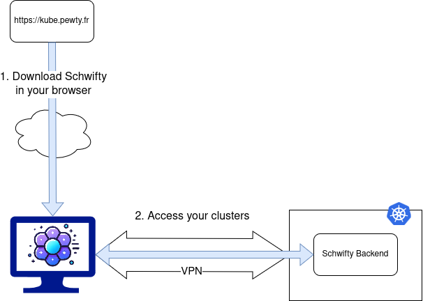
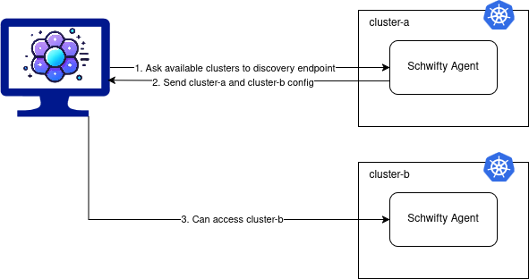

# schwifty


Fully customizable & Secure Kubernetes UI.

You can define different views depending on the group of the connected users.

All data stays in your browser. No external SaaS is used.

Schwifty is made to help non-Kubernetes experts to enjoy their needed resources.

## Features

- Authentication: 
  - No Auth
  - Basic
  - OpenIDConnect (External or Kubernetes)

- Customizations:
  - All components can be defined per user group
  - Navigation can use any CRD
  - List views columns
  - Get views content
  - Actions (get, edit, delete, cordon, uncordon, drain, portforward, logs, FluxCD Sync, FluxCD Pause, FluxCD Resume)
  
- Portforward: in browser access to HTTP app

- Multi clusters access & automatic discovery (no setup needed for your customers!)

## Features to come

- Customizations:
  - Actions :
    - exec
    - scale
    - dynamic redirect: button that redirect to a link containing resource data. For example, a link to Grafana panel, containing pod name in query parameters.
    - Velero: to trigger backup on a PV or PVC.
    - Secrets Manager: to force sync a secret.
  - Define customization per platform

- Integrate Grafana panels to home page or get views
  
- Portforward: handle basic auth in browser

- Android/iOS app

- Windows / Linux app

## Demo

[You can try Schwifty here](https://app.schwifty.fr/#/discovery?endpoint=https://demo.schwifty.fr)

You can login using the next accounts (read-only).

Note that each account has a differently customized view, explore them ! 😉

```
- username: schwifty-admin
  password: schwifty
- username: schwifty-dev
  password: schwifty
- username: schwifty-support
  password: schwifty
```

## Getting Started

Schwifty is running entirely in your browser. All your data stays in browser and in your Kubernetes clusters.



To access your clusters, you must setup a Schwifty Backend in each cluster. Some configuration is needed.

```
kubectl create ns schwifty
helm upgrade --install schwifty -n schwifty chart/ -f chart/values.yaml
```

## Values

### Configuration

| Parameter                 | Type   | Description                                               |
|---------------------------|--------|-----------------------------------------------------------|
| `config.logLevel`         | string | Log level: debug, info, warning, error, fatal             |
| `config.originUrl`        | string | Used to add CORS headers. Default `https://kube.pewty.fr` |
| `config.portforwardUrl`   | string | Used for security check during portforwarding             |
| `config.port.api`         | string | Api port                                                  |
| `config.port.portforward` | string | Portforward port                                          |

### Discovery

Schwifty can automaticaly get all available clusters by using a discovery endpoint.



In a multi-cluster setup, you can define one Schwifty Backend as your discovery endpoint. It will be responsible to send to your browser all available clusters.

All other Schwifty Backends can disable discovery endpoint.

| Parameter                                 | Type   | Description                                              |
|-------------------------------------------|--------|----------------------------------------------------------|
| `config.api.discovery.enabled`            | bool   | Enable                                                   |
| `config.api.clusters.*.name`              | string | Name of the cluster                                      |
| `config.api.clusters.*.apiUrl`            | string | Url of Schwifty Backend API                              |
| `config.api.clusters.*.portforwardUrl`    | string | Url of Schwifty Backend dedicated to portforward         |
| `config.api.clusters.*.customizationRef`  | string | Name of the cluster referent for Schwifty Customization  |
| `config.api.clusters.*.authenticationRef` | string | Name of the cluster referent for Schwifty Authentication |
| `config.api.clusters.*.discoveryRef`      | string | Name of the cluster referent for Schwifty Discovery      |

### Customizations

In a multi-cluster setup, you can define one Schwifty Backend as your customization endpoint. It will be responsible to get the customization for your users.

Define what customization parameters for which user's group:

| Parameter                         | Type   | Description                                                   |
|-----------------------------------|--------|---------------------------------------------------------------|
| `customizations.*`                | string | Name of the customization block                               |
| `customizations.*.groupSelector`  | string | Regex of SSO user's group to affect this customization        |
| `customizations.*.action`         | string | Name of custom actions block                                  |
| `customizations.*.navigation`     | string | Name of custom navigations block                              |
| `customizations.*.list`           | string | Name of custom lists block                                    |
| `customizations.*.edit`           | string | Name of custom edits block                                    |
| `customizations.*.link`           | string | Name of custom links block                                    |

### Actions

Define what your user can do on each resource:

| Parameter             | Type   | Description                                              |
|-----------------------|--------|----------------------------------------------------------|
| `actions.*`           | string | Name of the action block                                 |
| `actions.*.*`         | string | Name of the action                                       |
| `actions.*.*.include` | list   | Enable an action for a list of Kubernetes resources      |
| `actions.*.*.exclude` | list   | Disable an action for a list of Kubernetes resources     |

#### Available actions

| Action      | Description                                       |
|-------------|---------------------------------------------------|
| get         | Display details of Kubernetes resource            |
| update      | Allow edition of Kubernetes resource              |
| delete      | Allow deletion of Kubernetes resource             |
| create      | Allow creation of Kubernetes resource             |
| cordon      | Cordon a node                                     |
| uncordon    | Uncordon a node                                   |
| drain       | Drain a node                                      |
| exec        | Start a terminal on pod                           |
| logs        | Display logs of pod                               |
| portforward | Display http endpoint of pods                     |
| sync        | Add an annotation to trigger update of resource   |
| pause       | Pause a FluxCD resource                           |
| resume      | Resume a FluxCD resource                          |

### Navigations

Define what resource are accessible from navigation:

| Parameter                     | Type   | Description                                                                                               |
|-------------------------------|--------|-----------------------------------------------------------------------------------------------------------|
| `navigations.*`               | string | Name of the navigation block                                                                              |
| `navigations.*.items`         | list   | First level of nav                                                                                        |
| `navigations.*.items.*.label` | string | Nav label                                                                                                 |
| `navigations.*.items.*.icon`  | string | Nav icon (can be svg or png or [int](https://api.flutter.dev/flutter/material/Icons-class.html#constants))|
| `navigations.*.items.*.route` | string | Kubernetes resource name like `namespaces` or `apps/deployments`                                          |
| `navigations.*.items.*.items` | list   | Second level of nav                                                                                       |
| `navigations.*.other.enabled` | bool   | Special nav for all unhandled Kubernetes resources                                                        |
| `navigations.*.other.label`   | string | Label for this special nav                                                                                |
| `navigations.*.other.icon`    | string | Icon for this special nav                                                                                |

### Lists

Defines the columns to display for each Kubernetes resource. If undefined, it displays: Name, Namespace and Creation Date.

| Parameter                   | Type   | Description                                                       |
|-----------------------------|--------|-------------------------------------------------------------------|
| `listViews.*`               | string | Name of the list block                                            |
| `listViews.*.*`             | string | Kubernetes resource name like `namespaces` or `apps/deployments`  |
| `listViews.*.*.*.label`     | string | Label of column                                                   |
| `listViews.*.*.*.key`       | string | JSON Path selection of value                                      |
| `listViews.*.*.*.type`      | string | Unused                                                            |
| `listViews.*.*.width`       | int    | Width allocated in table                                          |
| `listViews.*.*.selectable`  | bool   | If text is selectable                                             |

### Get

Define what fields are displayed on page for unique resource:

| Parameter                  | Type   | Description                                                       |
|----------------------------|--------|-------------------------------------------------------------------|
| `getViews.*`               | string | Name of the edit block                                            |
| `getViews.*.*`             | string | Kubernetes resource name like `namespaces` or `apps/deployments`  |
| `getViews.*.*.*.label`     | string | Label of column                                                   |
| `getViews.*.*.*.key`       | string | JSON Path selection of value                                      |
| `getViews.*.*.*.type`      | string | See get types                                                     |

#### Get types

| Type          | Description                                                 |
|---------------|-------------------------------------------------------------|
| block         | Default type. Display all content as block. Can be a map.   |
| fields        | More compact. Can be a map.                                 |
| base64fields  | Allow base64 decoding. Can be a map.                        |
| field         | Must be a string                                            |

### Authentications

#### No auth

Directly use Impersonation on the configured groups.

| Parameter                                  | Type         | Description                       |
|--------------------------------------------|--------------|-----------------------------------|
| `config.api.authentication.noAuth.enabled` | bool         | Enable                            |
| `config.api.authentication.noAuth.groups`  | list(string) | List of groups use to Impersonate |

#### Basic

Schwifty Backend authenticate users against a list of credentials stored in Kubernetes. Once authenticated, it uses Impersonation with user groups.

| Parameter                                              | Type   | Description                                      |
|--------------------------------------------------------|--------|--------------------------------------------------|
| `config.api.authentication.basic.enabled`              | bool   | Enable                                           |
| `config.api.authentication.basic.salt`                 | string | A salt added before password hashing             |
| `config.api.authentication.basic.secretRef.name`       | string | Name of secret containing users credentials      |
| `config.api.authentication.basic.secretRef.namespace`  | string | Namespace of secret containing users credentials |

##### Generate users credentials

We recommand that end user hash its password and send it to Schwifty administrator:

```
echo -n "my-super-password" | sha256sum
> 819f7644f7883384ffdf2522826d38afeafb4338374e71cdeff315e8831e0c6f
```

Then Schwifty administrator hash it again adding server salt:

```
SALT="aith7eCh6Vohwahgh5zuzah0fieh5h"; echo -n "819f7644f7883384ffdf2522826d38afeafb4338374e71cdeff315e8831e0c6f$SALT" | sha256sum
> 1d7427cc7ac11f0fb70808c32a7114c4f833ad1c58f770d1c52cc9786a93678d
```

Or a one-liner:
```
PASSWORD=$(echo -n "my-super-password" | sha256sum | awk '{print $1}'); SALT="aith7eCh6Vohwahgh5zuzah0fieh5h"; echo -n "$PASSWORD$SALT" | sha256sum
```

Then store that password:

```
users:
  - username: "j.smith"
    password: "1d7427cc7ac11f0fb70808c32a7114c4f833ad1c58f770d1c52cc9786a93678d"
    groups:
      - "reader"
```

| Parameter          | Type         | Description                                      |
|--------------------|--------------|--------------------------------------------------|
| `users.*.username` | string       | Username                                         |
| `users.*.password` | string       | Password (user hash -> admin salt -> admin hash) |
| `users.*.groups`   | list(string) | Groups used for Impersonation                    |

#### OIDC

ExternalOidc & KubernetesOidc configuration do not differs. The main difference between the two methods is the use of Impersonation (through Schwifty Backend Service Account) with ExternalOidc, while Kubernetes Oidc use directly negociated token to authenticate.

To enable Kubernetes Oidc, please refers to [this documentation](https://kubernetes.io/docs/reference/access-authn-authz/authentication/#openid-connect-tokens).

| Parameter                                              | Type   | Description                                      |
|--------------------------------------------------------|--------|--------------------------------------------------|
| `config.api.authentication.externalOidc.enabled`       | bool   | Enable                                           |
| `config.api.authentication.externalOidc.clientId`      | string | OIDC Client ID                                   |
| `config.api.authentication.externalOidc.clientSecret`  | string | OIDC Client Secret                               |
| `config.api.authentication.externalOidc.issuerUrl`     | string | OIDC Issuer Url                                  |
| `config.api.authentication.externalOidc.redirectUrl`   | string | OIDC Redirect Url                                |
| `config.api.authentication.externalOidc.groupsClaim`   | string | Where to find users groups                       |
| `config.api.authentication.externalOidc.usernameClaim` | string | Where to find user names                         |
| `config.api.authentication.externalOidc.groupsPrefix`  | string | Prefix to add to found groups                    |
