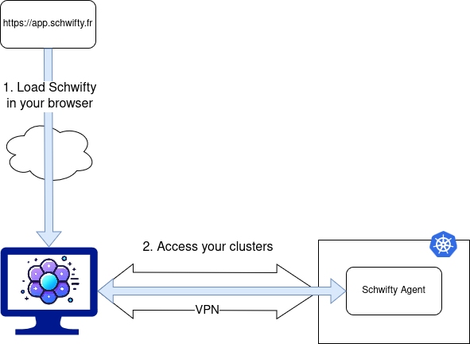

# schwifty


Fully customizable & Secure Kubernetes UI.

You can define different views depending on the group of the connected users.

All data stays in your browser. No external SaaS is used.

Schwifty is made to help non-Kubernetes experts to enjoy their needed resources.

## Features

- Authentication: 
  - No Auth
  - Basic
  - OpenIDConnect (External or Kubernetes)

- Customizations:
  - All components can be defined per user group
  - Navigation can use any CRD
  - List views columns
  - Get views content
  - Actions (get, edit, delete, cordon, uncordon, drain, portforward, logs)
  - Customizable actions: extend Schwifty capabilities for your own CRD. For example, easily add FluxCD Sync/Pause/Resume, Velero Backup, External Secret Sync buttons.
  
- Portforward: in browser access to HTTP app

- Multi clusters access & automatic discovery (no setup needed for your customers!) limited to 2 clusters

### Enterprise features

- All previous features
- Deploy your own web interface (to avoid using https://app.schwifty.fr)
- Multi clusters access & automatic discovery (no setup needed for your customers!) with unlimited clusters

## Features to come

- Customizations:
  - Define customization per platform
  
- Portforward: handle basic auth in browser

- Integrate Grafana panels to home page or get views
  
- Audit logs in Agent

- Android/iOS app

- Windows / Linux app

## Demo

[You can try Schwifty here](https://app.schwifty.fr/#/discovery?endpoint=https://api.demo.schwifty.fr)

You can login using the next accounts (read-only).

Note that each account has a differently customized view, explore them ! 😉

```
- username: schwifty-admin
  password: schwifty
- username: schwifty-dev
  password: schwifty
- username: schwifty-support
  password: schwifty
```

## Getting Started

Schwifty is running entirely in your browser. All your data stays in browser and in your Kubernetes clusters.



To access your clusters, you must setup a Schwifty Agent in each cluster. Some configuration is needed.


```
kubectl create ns schwifty
helm upgrade --install agent -n schwifty oci://69b10931.c1.gra9.container-registry.ovh.net/schwifty-public/chart/agent
```

### Helm charts

Our helm charts are available here: https://github.com/pewty-fr/schwifty-helm

## Values

### Configuration

| Parameter                 | Type   | Description                                                 |
|---------------------------|--------|-------------------------------------------------------------|
| `config.logLevel`         | string | Log level: debug, info, warning, error, fatal               |
| `config.originUrl`        | string | Used to add CORS headers. Default `https://app.schwifty.fr` |
| `config.portforwardUrl`   | string | Used for security check during portforwarding               |
| `config.port.api`         | string | Api port                                                    |
| `config.port.portforward` | string | Portforward port                                            |

### Discovery

Schwifty can automaticaly get all available clusters by using a discovery endpoint.


In a multi-cluster setup, you can define one Schwifty Agent as your discovery endpoint. It will be responsible to send to your browser all available clusters.

All other Schwifty Agents can disable discovery endpoint.

| Parameter                                 | Type   | Description                                              |
|-------------------------------------------|--------|----------------------------------------------------------|
| `config.api.discovery.enabled`            | bool   | Enable                                                   |
| `config.api.clusters.*.name`              | string | Name of the cluster                                      |
| `config.api.clusters.*.apiUrl`            | string | Url of Schwifty Agent API                              |
| `config.api.clusters.*.portforwardUrl`    | string | Url of Schwifty Agent dedicated to portforward         |
| `config.api.clusters.*.customizationRef`  | string | Name of the cluster referent for Schwifty Customization  |
| `config.api.clusters.*.authenticationRef` | string | Name of the cluster referent for Schwifty Authentication |
| `config.api.clusters.*.discoveryRef`      | string | Name of the cluster referent for Schwifty Discovery      |

### Customizations

In a multi-cluster setup, you can define one Schwifty Agent as your customization endpoint. It will be responsible to get the customization for your users.

Define what customization parameters for which user's group:

| Parameter                         | Type   | Description                                                   |
|-----------------------------------|--------|---------------------------------------------------------------|
| `customizations.*`                | string | Name of the customization block                               |
| `customizations.*.groupSelector`  | string | Regex of SSO user's group to affect this customization        |
| `customizations.*.action`         | string | Name of custom actions block                                  |
| `customizations.*.navigation`     | string | Name of custom navigations block                              |
| `customizations.*.listView`       | string | Name of custom lists block                                    |
| `customizations.*.getView`        | string | Name of custom get   block                                    |

### Actions

Define what your user can do on each resource:

| Parameter                               | Type   | Description                                                                                                             |
|-----------------------------------------|--------|-------------------------------------------------------------------------------------------------------------------------|
| `actions.*`                             | string | Name of the action block                                                                                                |
| `actions.*.*`                           | string | Name of the action                                                                                                      |
| `actions.*.*.include`                   | list   | Enable an action for a list of Kubernetes resources                                                                     |
| `actions.*.*.exclude`                   | list   | Disable an action for a list of Kubernetes resources                                                                    |
| `actions.*.*.verb`                      | string | For custom actions, can be `patch`, `create` or `link`                                                                  |
| `actions.*.*.title`                     | string | Name of custom action                                                                                                   |
| `actions.*.*.icon`                      | string | Icon of custom action (can be svg or png or [int](https://api.flutter.dev/flutter/material/Icons-class.html#constants)) |
| `actions.*.*.payloadTemplate`           | string | JSON Payload used with custom action                                                                                    |
| `actions.*.*.parameters.*.name`         | string | Name of parameter used by custom action                                                                                 |
| `actions.*.*.parameters.*.defaultValue` | string | Default value of parameter                                                                                              |
| `actions.*.*.parameters.*.description`  | string | Description fo parameter                                                                                                |

include & exclude list allow to enable or disable an action for a given resource.

#### Predefined actions

| Action      | Description                                       |
|-------------|---------------------------------------------------|
| get         | Display details of Kubernetes resource            |
| edit        | Allow edition of Kubernetes resource              |
| delete      | Allow deletion of Kubernetes resource             |
| create      | Allow creation of Kubernetes resource             |
| cordon      | Cordon a node                                     |
| uncordon    | Uncordon a node                                   |
| drain       | Drain a node                                      |
| exec        | Start a terminal on pod                           |
| logs        | Display logs of pod                               |
| portforward | Display http endpoint of pods                     |

#### Custom actions

You can defined your own action on a given resource.

##### Link

To create an action that open a grafana dashboard link based on pod resource:

```
grafana:
  include:
    - "pods"
  exclude: []
  verb: 'link'
  title: 'Grafana'
  icon: 'https://upload.wikimedia.org/wikipedia/commons/3/3b/Grafana_icon.svg'
  payloadTemplate: "https://grafana.schwifty.fr/d/Schwifty/pods?orgId=1&var-namespace={{#ty_jsonpath}}$.metadata.namespace{{/ty_jsonpath}}&var-pod={{#ty_jsonpath}}$.metadata.name{{/ty_jsonpath}}"
  parameters: []
```

`{{#ty_jsonpath}}$.metadata.namespace{{#ty_jsonpath}}` is a mustache lambda that will get namespace value from clicked pod and replace it in URL. See Templating section for more.

##### Create / Patch

```
scale:
  include:
    - "apps/deployments"
    - "apps/statefulsets"
    - "apps/replicasets"
  exclude:
    - "*"
  verb: 'patch'
  title: 'Scale'
  icon: '57730'
  payloadTemplate: |
    {
      "spec": {
        "replicas": {{ty_parameters.replicas}}
      }
    }
  parameters:
    - name: "replicas"
      defaultValue: "{{spec.replicas}}"
      description: "Number of replicas"
```

`{{ty_parameters.replicas}}` will be replaced by corresponding parameter value that user will have to define after clicking on action button.

`{{ty_datenow}}` is a special templating lambda that will inject current date in payload. See Templating section for more. 

### Navigations

Define what resource are accessible from navigation:

| Parameter                     | Type   | Description                                                                                               |
|-------------------------------|--------|-----------------------------------------------------------------------------------------------------------|
| `navigations.*`               | string | Name of the navigation block                                                                              |
| `navigations.*.items`         | list   | First level of nav                                                                                        |
| `navigations.*.items.*.label` | string | Nav label                                                                                                 |
| `navigations.*.items.*.icon`  | string | Nav icon (can be svg or png or [int](https://api.flutter.dev/flutter/material/Icons-class.html#constants))|
| `navigations.*.items.*.route` | string | Kubernetes resource name like `namespaces` or `apps/deployments`                                          |
| `navigations.*.items.*.items` | list   | Second level of nav                                                                                       |
| `navigations.*.other.enabled` | bool   | Special nav for all unhandled Kubernetes resources                                                        |
| `navigations.*.other.label`   | string | Label for this special nav                                                                                |
| `navigations.*.other.icon`    | string | Icon for this special nav                                                                                |

### Lists

Defines the columns to display for each Kubernetes resource. If undefined, it displays: Name, Namespace and Creation Date.

| Parameter                        | Type   | Description                                                       |
|----------------------------------|--------|-------------------------------------------------------------------|
| `listViews.*`                    | string | Name of the list block                                            |
| `listViews.*.*.include`          | list   | Enable a list view for a list of Kubernetes resources             |
| `listViews.*.*.exclude`          | list   | Disable a list view action for a list of Kubernetes resources     |
| `listViews.*.*.items.*.label`    | string | Label of column                                                   |
| `listViews.*.*.items.*.template` | string | Templating                                                        |
| `listViews.*.*.items.*.type`     | string | See below                                                         |
| `listViews.*.*.width`            | int    | Width allocated in table                                          |

#### Type

| Type             | Description                                                                                                         |
|------------------|---------------------------------------------------------------------------------------------------------------------|
| duration         | Convert timestamp to duration                                                                                       |
| link             | Display a cliquable link (can be multiple links separated by comma)                                                 |
| containerStatus  | Display containers status using squares 🟩🟧🔲                                                                      |
| nodeMetrics      | Display CPU/Memory progress bar (< 80% = 🟩, < 90% = 🟧, > 90% = 🟥)                                                |
| podMetrics       | Display CPU/Memory progress bar (Used < Requested = 🟩, Requested < Used < Limit 🟧, Limit (or no limit) < Used 🟥) |
| podCpuMetrics    | Display CPU progress bar (Used < Requested = 🟩, Requested < Used < Limit 🟧, Limit (or no limit) < Used 🟥)        |
| podMemoryMetrics | Display Memory progress bar (Used < Requested = 🟩, Requested < Used < Limit 🟧, Limit (or no limit) < Used 🟥)     |
| percentageBar    | Create a progress bar from a given template `{{value}}/{{divider}}`                                                 |

##### Percentage Bar

```
        - label: Memory Limits
          template: >-
            {{#ty_memory}}{{status.resources.memory}}{{/ty_memory}}/{{#ty_memory}}{{spec.limits.memory}}{{/ty_memory}}
          type: percentageBar
```

This percentage bar will use value `status.resources.memory` and divider `spec.limits.memory` from a Kubernetes resource. If `value = 50` and `divider = 100`, progress bar will be half filled.

### Get

Define what fields are displayed on page for unique resource:

| Parameter                    | Type   | Description                                                       |
|------------------------------|--------|-------------------------------------------------------------------|
| `getViews.*`                 | string | Name of the get block                                             |
| `getViews.*.*.include`       | list   | Enable a list view for a list of Kubernetes resources             |
| `getViews.*.*.exclude`       | list   | Disable a list view action for a list of Kubernetes resources     |
| `getViews.*.*.items.*.label` | string | Label of column                                                   |
| `getViews.*.*.items.*.key`   | string | JSON Path selection of value                                      |


### Authentications

#### No auth

Directly use Impersonation on the configured groups.

| Parameter                                  | Type         | Description                       |
|--------------------------------------------|--------------|-----------------------------------|
| `config.api.authentication.noAuth.enabled` | bool         | Enable                            |
| `config.api.authentication.noAuth.groups`  | list(string) | List of groups use to Impersonate |

#### Basic

Schwifty Agent authenticate users against a list of credentials stored in Kubernetes. Once authenticated, it uses Impersonation with user groups.

| Parameter                                              | Type   | Description                                      |
|--------------------------------------------------------|--------|--------------------------------------------------|
| `config.api.authentication.basic.enabled`              | bool   | Enable                                           |
| `config.api.authentication.basic.salt`                 | string | A salt added before password hashing             |
| `config.api.authentication.basic.secretRef.name`       | string | Name of secret containing users credentials      |
| `config.api.authentication.basic.secretRef.namespace`  | string | Namespace of secret containing users credentials |

##### Generate users credentials

We recommand that end user hash its password and send it to Schwifty administrator:

```
echo -n "my-super-password" | sha256sum
> 819f7644f7883384ffdf2522826d38afeafb4338374e71cdeff315e8831e0c6f
```

Then Schwifty administrator hash it again adding server salt:

```
SALT="aith7eCh6Vohwahgh5zuzah0fieh5h"; echo -n "819f7644f7883384ffdf2522826d38afeafb4338374e71cdeff315e8831e0c6f$SALT" | sha256sum
> 1d7427cc7ac11f0fb70808c32a7114c4f833ad1c58f770d1c52cc9786a93678d
```

Or a one-liner:
```
PASSWORD=$(echo -n "my-super-password" | sha256sum | awk '{print $1}'); SALT="aith7eCh6Vohwahgh5zuzah0fieh5h"; echo -n "$PASSWORD$SALT" | sha256sum
```

Then store that password:

```
users:
  - username: "j.smith"
    password: "1d7427cc7ac11f0fb70808c32a7114c4f833ad1c58f770d1c52cc9786a93678d"
    groups:
      - "reader"
```

| Parameter          | Type         | Description                                      |
|--------------------|--------------|--------------------------------------------------|
| `users.*.username` | string       | Username                                         |
| `users.*.password` | string       | Password (user hash -> admin salt -> admin hash) |
| `users.*.groups`   | list(string) | Groups used for Impersonation                    |

#### OIDC

ExternalOidc & KubernetesOidc configuration do not differs. The main difference between the two methods is the use of Impersonation (through Schwifty Agent Service Account) with ExternalOidc, while Kubernetes Oidc use directly negociated token to authenticate.

To enable Kubernetes Oidc, please refers to [this documentation](https://kubernetes.io/docs/reference/access-authn-authz/authentication/#openid-connect-tokens).

| Parameter                                              | Type   | Description                                      |
|--------------------------------------------------------|--------|--------------------------------------------------|
| `config.api.authentication.externalOidc.enabled`       | bool   | Enable                                           |
| `config.api.authentication.externalOidc.clientId`      | string | OIDC Client ID                                   |
| `config.api.authentication.externalOidc.clientSecret`  | string | OIDC Client Secret                               |
| `config.api.authentication.externalOidc.issuerUrl`     | string | OIDC Issuer Url                                  |
| `config.api.authentication.externalOidc.redirectUrl`   | string | OIDC Redirect Url                                |
| `config.api.authentication.externalOidc.groupsClaim`   | string | Where to find users groups                       |
| `config.api.authentication.externalOidc.usernameClaim` | string | Where to find user names                         |
| `config.api.authentication.externalOidc.groupsPrefix`  | string | Prefix to add to found groups                    |


### Templating

Schwifty use [Mustache](https://mustache.github.io/) as templating engine.

#### Lambdas

- `ty_datenow`: generate date of day in ISO 8601 format
- `ty_cpu`: convert a Kubernetes cpu string (`1` or `1000m` or `1000000000n`) to a double
- `ty_memory`: convert a Kubernetes memory string (`1Gi` or `1024Mi`, etc) to a double
- `ty_jsonpath`: to access a field in a Kubernetes resource
- `ty_parameters`: to inject parameters in customized actions
- `ty_httpshosts`: take a list of host like `["example.com", "test.com"]` and convert it to a suitable `listViews` link type item like `https://example.com,https://test.com`.
